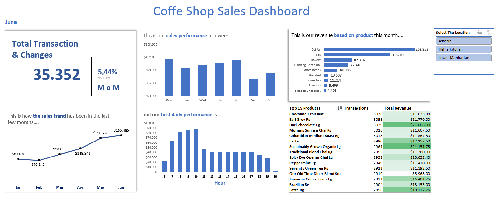
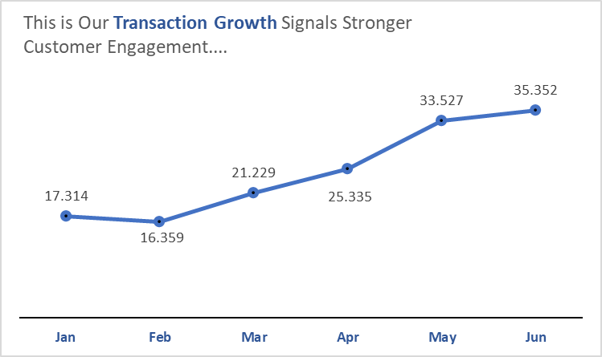
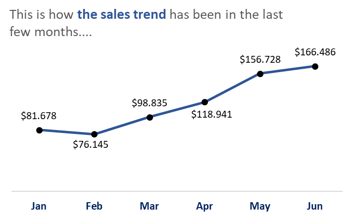
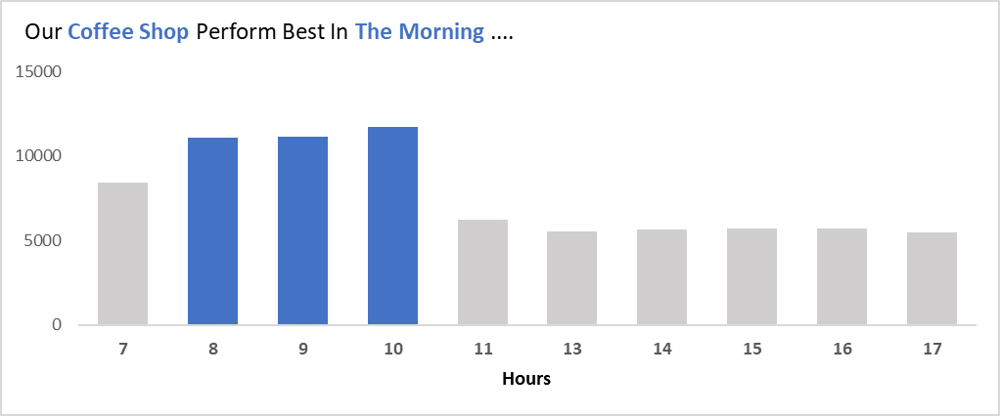
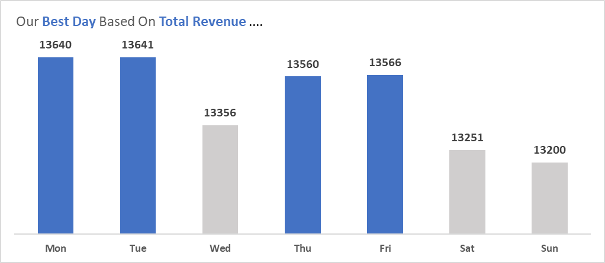
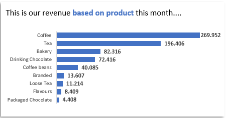
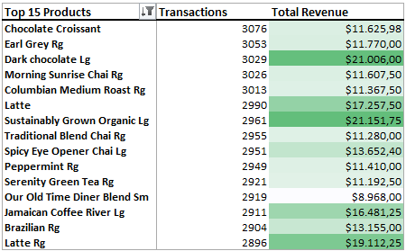

# Coffee Shop Sales Analysis

**Brewly Beans**, a growing coffee shop chain with several locations across the city, is looking to **improve operational efficiency and strategic decision-making** by becoming a data-driven organization. To support this goal, the company initiated a project to develop an interactive sales dashboard using Excel. This dashboard enables store managers and executives to track key metrics such as monthly revenue, best-selling products, sales by category, and seasonal performance trends — helping them make informed decisions on inventory, marketing campaigns, and staffing.

---

## Project Background  

Brewly Beans is a local coffee shop chain that has been operating since 2018, offering a wide range of specialty coffee drinks, light snacks, and seasonal products. The company follows a B2C (Business-to-Consumer) model with several branches located across both urban and suburban areas. All sales transactions are recorded using a digital Point-of-Sale (POS) system.   

The goal of this project was to support Brewly Beans in becoming a more data-driven organization. I was tasked with analyzing historical sales data and developing an interactive dashboard in Excel to help business stakeholders make more informed decisions.   

All analysis for this project was conducted using Microsoft Excel, leveraging Pivot Tables and interactive dashboards to visualize sales trends and performance metrics. The goal of this project is to empower store managers, marketing teams, and decision-makers with clear insights that can inform inventory planning, promotional strategies, and business growth initiatives.  

### Key Analysis Areas:  
1. **KPI**: Number of transactions in current month; Comparison value: MoM (Month over Month) growth to see how transaction volume changes from the previous month.   
2. **Time-Based Sales Performance**: Compare how sales trend in previous month  
3. **Product Performance**: Analyzes sales by product to identify bestsellers, underperforming items, and overall contribution to total revenue. 
4. **KPI**: Top 15 Products which generate the highest sales revenue, helping identify customer favorites and key drivers of profit.

*(Note: If you'd like to explore the Excel file used for this project in more detail, please refer to the data section.)*  

---

## Data Structure & Initial Checks  
The dataset contains **14,000+** transactions with the following fields:

- **Transaction Date | Transaction Time**
- **Store ID | Store Location**
- **Product ID | Product Category | Product Type | Product Detail**
- **Transaction Quantity | Unit Price | Revenue**

Initial checks were performed to ensure date and time formats were consistent, revenue calculations matched unit price × quantity, and there were no missing values in key fields such as store or product identifiers. 

> ⚠️ Disclaimer:   
**The dataset used in this project is not structured according to standard database normalization rules**. Some fields contain repeated or nested information, and product-related details are stored in a single flat table rather than separated into dimension tables. As such, this **dataset is intended solely for analytical purposes** and dashboard creation, not for transactional or relational database use.

---

## Executive Summary  
**Top 3 Insights:**  
1. **Coffee drinks contribute to 38.63% of total revenue**, with Latte Regular being the top customer favorite, indicating strong demand for caffeinated beverages.  
2. **Customer peak hours are in the morning (8–10 AM)** and **Our Best Days in a week is by Monday & Wednesday** , accounting for 44.54% of daily sales; potential staffing shortages during these hours may slow down service and reduce order fulfillment.  
3. **There is a 5.44% increase in transactions compared to the previous month (MoM)**, showing a positive growth trend and an opportunity to boost marketing or stock top-selling products accordingly.  

---

## Insights Deep Dive  

### Positive Transaction Growth  
- **Total transactions in June reached 35.352**, reflecting a 5.44% increase compared to May — a clear indicator of continued business momentum.*  
- A **steady month-over-month (MoM)** growth trend has been observed since February, signaling sustained customer engagement and possibly successful marketing or seasonal factors.
- Alongside transaction growth, **total revenue has also climbed**, suggesting higher overall customer activity and potentially improved average order value.

  
  

### Week and Time-day Performances  
- The time period between **9:00 AM – 10:00 AM** records the highest sales volume, aligning with typical morning coffee runs.

- **A significant drop in transactions is observed after 10:00 PM**; however, the volume remains relatively stable throughout the subsequent late-night hours. 

- **Monday and Friday** consistently deliver the highest revenue, likely due to routine workweek traffic and end-of-week habits. 
- **Weekend sales (Saturday and Sunday)** show noticeable decline, possibly due to fewer commuters or a shift in customer behavior on non-working days. 

### Product Contribution Breakdown  
- Coffee leads revenue contribution with $269,952, followed by Tea with $196,406 — confirming that beverages are the core drivers of sales.  
- Packaged Chocolate and Flavours show minimal revenue impact, suggesting they may not resonate as strongly with the customer base. 

- Top-selling items by transaction volume include Chocolate Croissant, Earl Grey Rg, and Dark Chocolate Lg, which show high customer preference and frequent purchase rates.
- The highest-revenue product is Latte Rg, generating $19,112.25, suggesting it may carry both high unit price and popularity.
 

---

## Recommendations  
1. **Optimize Staffing During Peak Hours:** Increase the number of frontline staff during weekday mornings (especially 8–10 AM on Mondays and Wednesdays) to handle high traffic efficiently and reduce customer wait times..  
2. **Expand Coffee-Based Offerings:** As coffee contributes nearly 39% of revenue, consider expanding the variety of coffee drinks or introducing seasonal limited-time offers (e.g., holiday lattes) to drive repeat visits.  
3. **Reevaluate Weekend Strategy:** Explore targeted promotions, loyalty perks, or events on Saturdays and Sundays to address lower weekend sales — possibly attract remote workers or families..  
4. **Monitor and Replenish Top-Sellers Proactively:** Ensure high stock availability for best-performing items like Latte Rg and Earl Grey Rg, particularly during high-traffic hours, to avoid lost sales due to stockouts.  

---

## Assumptions & Caveats  
- Product Detail Labels (e.g., “Lg”, “Rg”) were assumed to indicate size variants (“Large”, “Regular”), though standardization is recommended to avoid reporting inconsistencies.  
- No Customer Demographics are available in this dataset, limiting deeper behavioral segmentation (e.g., age-based preferences or gender trends)..  
- Seasonal Effects Not Fully Accounted For, as the current dataset only covers six months and does not span major holidays or special events.  

 