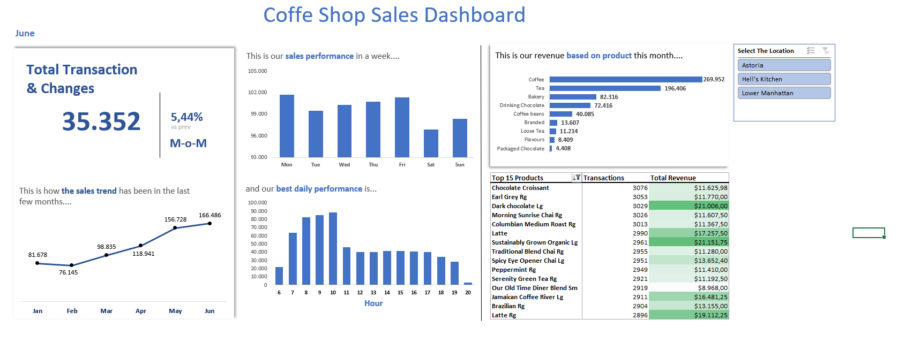

# Coffee Shop Sales Analysis

**Brewly Beans**, a growing coffee shop chain with several locations across the city, is looking to **improve operational efficiency and strategic decision-making** by becoming a data-driven organization. To support this goal, the company initiated a project to develop an interactive sales dashboard using Excel. This dashboard enables store managers and executives to track key metrics such as monthly revenue, best-selling products, sales by category, and seasonal performance trends — helping them make informed decisions on inventory, marketing campaigns, and staffing.

---

## Project Background  

Brewly Beans is a local coffee shop chain that has been operating since 2018, offering a wide range of specialty coffee drinks, light snacks, and seasonal products. The company follows a B2C (Business-to-Consumer) model with several branches located across both urban and suburban areas. All sales transactions are recorded using a digital Point-of-Sale (POS) system.   

The goal of this project was to support Brewly Beans in becoming a more data-driven organization. I was tasked with analyzing historical sales data and developing an interactive dashboard in Excel to help business stakeholders make more informed decisions.   

All analysis for this project was conducted using Microsoft Excel, leveraging Pivot Tables and interactive dashboards to visualize sales trends and performance metrics. The goal of this project is to empower store managers, marketing teams, and decision-makers with clear insights that can inform inventory planning, promotional strategies, and business growth initiatives.  

### Key Analysis Areas:  
1. **KPI**: Number of transactions in current month; Comparison value: MoM (Month over Month) growth to see how transaction volume changes from the previous month.   
2. **Time-Based Sales Performance**: Compare how sales trend in previous month  
3. **Product Performance**: Analyzes sales by product to identify bestsellers, underperforming items, and overall contribution to total revenue. 
4. **KPI**: Top 15 Products which generate the highest sales revenue, helping identify customer favorites and key drivers of profit.

*(Note: If you'd like to explore the Excel file used for this project in more detail, please refer to the data section.)*  

---

## Data Structure & Initial Checks  
The dataset includes **5,000+ transactions** with the following fields:  
- **Transaction ID** | **Date/Time** | **Store Location**  
- **Product Category** (Coffee, Food, Merchandise)  
- **Product Name** | **Quantity** | **Unit Price**  
- **Payment Method** | **Customer Type** (New/Returning)  

**Data Cleaning Steps:**  
- Removed 15 duplicate entries.  
- Standardized product names (e.g., "Latte" vs. "Caffe Latte").  
- Imputed missing customer types (assumed "New" for first-time store visits).  

---

## Executive Summary  
**Top 3 Insights:**  
1. **Coffee drinks drive 65% of revenue**, with cold brews outperforming hot coffees in summer (+40% sales).  
2. **Weekday mornings (7–9 AM)** account for 30% of daily sales; staffing shortages during these hours reduce order speed.  
3. **Store A** has 20% lower AOV than Store B due to limited food upsell promotions.  

  
*(Replace with a screenshot of your Excel dashboard)*  

---

## Insights Deep Dive  

### Category 1: Sales Trends by Product  
- **Cold brew sales peak in Q3** (July–Sept), contributing 25% of quarterly revenue. *Recommend seasonal marketing.*  
- **Food items have low attachment rates** (only 15% of coffee orders include food). Bundling could increase AOV.  

  

### Category 2: Time-Based Performance  
- **Weekend afternoons (2–4 PM)** have the lowest sales density. *Test happy hour promotions.*  
- **Subscription customers** order 3x more frequently but prefer off-peak hours.  

### Category 3: Store Comparison  
- **Store C** has the highest customer retention (45% returning) due to loyalty programs.  
- **Merchandise sales are stagnant** across all locations (<5% revenue).  

### Category 4: Customer Segmentation  
- **New customers** prefer card payments (80%), while **returning customers** use mobile wallets (60%).  

---

## Recommendations  
1. **Peak Hour Optimization:** Increase staff during weekday mornings and pilot a "quick brew" lane.  
2. **Product Bundling:** Pair pastries with coffee subscriptions to boost food sales.  
3. **Localized Promotions:** Target Store A with combo deals to match Store B’s AOV.  
4. **Data Collection:** Add customer age/gender fields to refine segmentation.  

---

## Assumptions & Caveats  
- Assumed missing "Customer Type" values were "New" if no prior transactions existed.  
- Excluded 10 refunded transactions (0.2% of data) for revenue clarity.  
- Holiday sales (December) were analyzed separately due to outlier trends.  

---

**Tools Used:** Excel (Pivot Tables, Dashboards)  
**Data Source:** [Coffee Shop Sales 2023.xlsx](/data/sales_data.xlsx) *(Replace with your file)*  