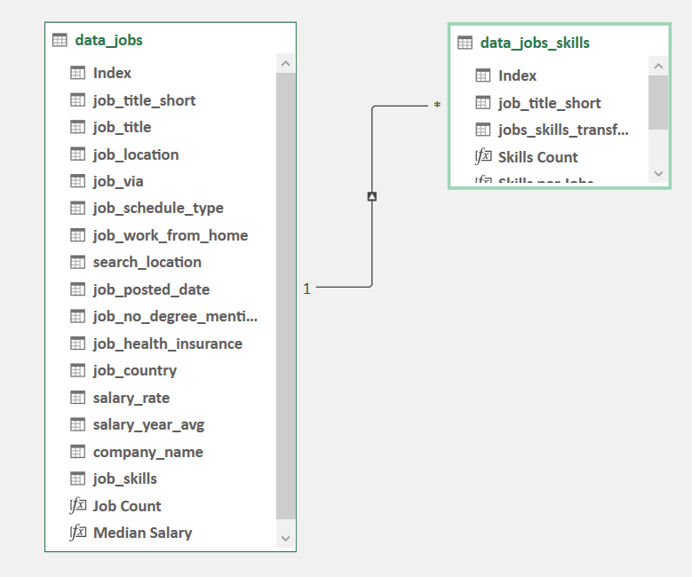
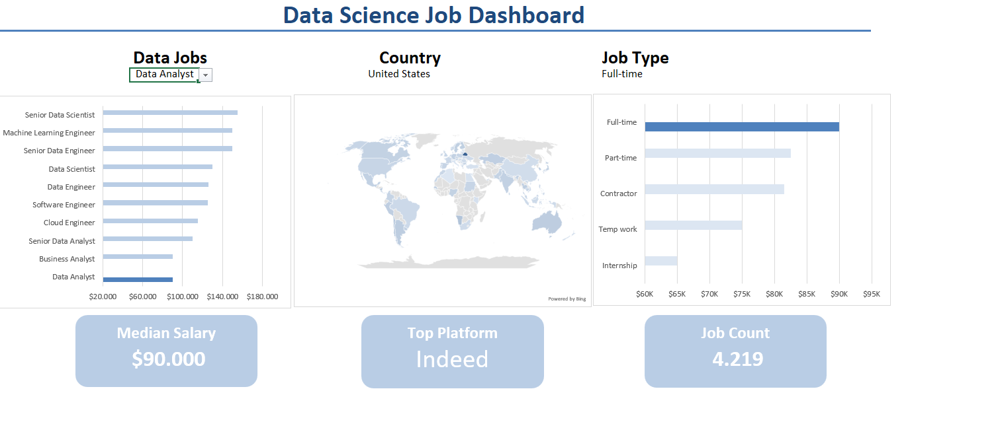
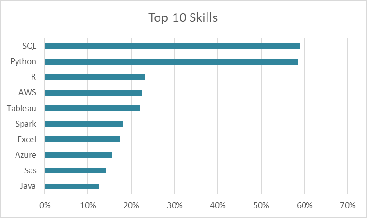
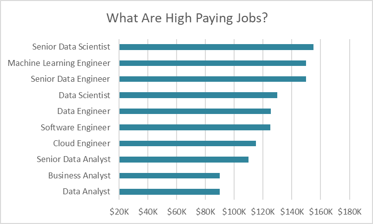
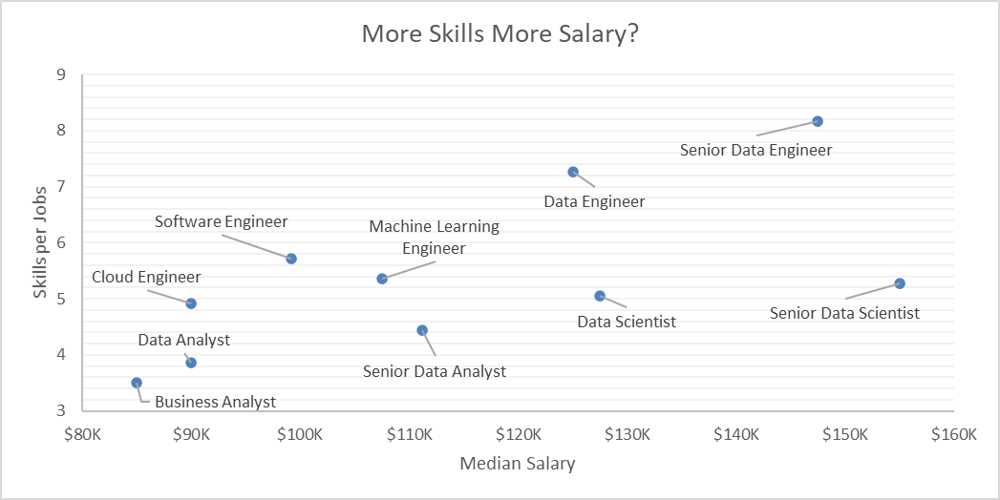

# Data Science Job Market Analysis

## 📌 Project Background

In the competitive field of Data Science, understanding job market trends is crucial for aspiring professionals and industry stakeholders. This project analyzes job postings for Data Science roles across multiple platforms (LinkedIn, Indeed, etc.) and various countries. The analysis provides insights into hiring trends, required skills, salary distributions, and location-based opportunities. 

## 📊 Data Structure & Initial Checks

The data contains information about Data Job Postings, including:

- **Job Title**: Contains the title of the job.
- **Job Via (platform)**: Identifies the platform where the job was posted, such as LinkedIn or Indeed.
- **Job Schedule Type**: Specifies the nature of the job, including full-time, part-time, contract, or internship.
- **Job Location**: Details the geographical distribution of job postings across different countries and cities.
- **Salary**: Displays compensation details, including salary range and currency.
- **Job Posted Date**: Provides the date when the job listing was published, helping track hiring trends over time.
- **Job Skills**: Lists required skills for each job posting, categorized into technical and soft skills.
- etc

**Entity Relationship Diagram (ERD):**

## 📌 Executive Summary

### **Overview of Findings**
- The demand for Data Science roles has continued to grow steadily in recent times.
- Python and SQL remain the most sought-after skills.
- The higher the skills you have, the higher the salary you will get.

## 🔍 Insights Deep Dive

### Skills & Requirements
- **SQL appears in 59%** of job postings, followed by **Python (57%) and R (60%)**.
- **Cloud Computing skills** like AWS appear in 23% of job postings, reflecting growing in industry demand. 

### Salary Analysis
- **Senior positions** lead in annual salaries, ranging from $100K to $150K per year.
- **Data Analyst is the lowest among the others**, but in terms of salary it is still a well-paid job.

### More Skills More Salary
- Senior Data Engineer and Senior Data Scientist earn the highest median salaries, exceeding $140K.
- Software Engineers and Machine Learning Engineers require around six skills per job and earn competitive salaries between $100K - $120K.
-  Business Analysts have the lowest skill requirements and median salaries, starting from $80K.

## 💡 Recommendations

Based on the findings, we suggest:
1. **For Job Seekers**: Focus on Python, SQL, and Cloud technologies to increase employability.
2. **For Employers**: Consider offering remote positions to attract global talent.
3. **For Industry Analysts**: Monitor the impact of AI automation on future hiring trends.

## ⚠️ Assumptions & Caveats
- Only publicly available job postings were included, which may not reflect the entire job market.

---
### 📢 Contact & Contributions
If you find this project valuable, feel free to connect or contribute! 🚀