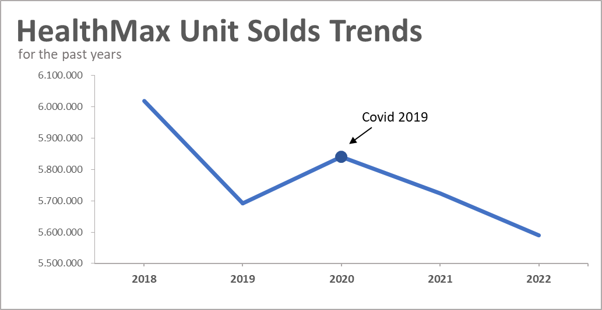

# Net Revenue Management Analysis

**HealthMax** is a Fast-Moving Consumer Goods (FMCG) company engaged in the personal care industry, one of its products is shampoo. Known for its commitment to quality and innovation, HealthMax continuously strives to strengthen its position in the competitive market by deeply understanding market dynamics and consumer behavior. The company is active in various marketing and promotional initiatives to ensure its products reach a wide target market.

---

## Project Background  

**HealthMax** is a *Fast-Moving Consumer Goods (FMCG)* company and one of its best products is Shampoo. As a data analyst, this project was initiated to conduct an in-depth analysis of net revenue management (NRM).   

This analysis will include identifying opportunities for net revenue optimization, evaluating the effectiveness of product pricing, and assessing the effectiveness of existing promotions. The results of this analysis are expected to provide strategic insights for HealthMax to make more informed decisions in terms of pricing, promotion allocation, and overall sales strategy, in order to maximize profitability and market share. 

## Key Findings:
1. **What has happened over the past few years?**: A review of historical sales data to understand unit sales volume and overall sales performance trends for HealthMax products over time.   
2. **Effectiveness of Pricing and Promotion Strategy**: An analysis to determine if the existing pricing and promotion strategies are effective in maximizing net revenue for HealthMax products. 
3. **Identifikasi Product Baru HealthMax**: Insights derived from market analysis and consumer trends to identify potential opportunities for new product development or expansion within the HealthMax product line.

## Data
This Net Revenue Management (NRM) analysis leverages a comprehensive dataset specifically designed to capture key sales and performance metrics for HealthMax's shampoo products. The data provides a granular view of market activities, enabling a detailed assessment of revenue drivers. 

*(Note: If you'd like to explore the Excel file used for this project in more detail, please refer to the data section.)* 

The columns are structured as follows:
- ***Category***: High-level product grouping (e.g., "Shampoo").
- ***Subcategory***: More specific product type within the category (e.g., "Anti-dandruff").
- ***Supplier***: The entity supplying the product (e.g., "Apex Trading Co.").
- ***Brand***: The specific brand of the product (e.g., "RedRose").
- ***Region***: The geographical sales region (e.g., "Center").
- ***Year***: The year of the sales data.
- ***Month***: The month of the sales data (represented numerically, 1-12).
- ***Units Month***: Total units sold within that specific month.
- ***Values Month***: Total revenue generated within that specific month.
- ***Units YTD***: Cumulative units sold from the beginning of the year up to the current month.
- ***Values YTD***: Cumulative revenue generated from the beginning of the year up to the current month.
- ***Units MAT***: Total units sold over the last 12 months (Moving Annual Total).
- ***Values MAT***: Total revenue generated over the last 12 months (Moving Annual Total).

## Metodologi Analisis
The methodology for this project was descriptive, agnostic, and predictive analysis. The selection of these methods was designed for a comprehensive overview of understanding HealthMax's current sales conditions, evaluating performance, and predicting future trends.

### Tools and Technology
| Tools             | Description                                                                 |
|-------------------------|--------------------------------------------------------------------------------------|
| **Microsoft Excel 2021**     | The ultimate platform for data analysis, metrics calculation, and results visualization.      |
| **Power Query**     | Used for pre-processing and initial data transformation      |
| **PivotTable & PivotChart** | Used to organize and visualize data based on certain dimensions.   |
| **Forecast Sheet**      | Used to generate forecasts of future sales revenue based on historical data.             |

## Insights Deep Dive 
### What has happened over the past few years?
**HEALTHMAX PRODUCTS**   
To look at HealthMax's performance in recent years, a descriptive analysis was performed. In the dataset, the data used to review sales performance can be seen in the *Values Month* and *Units Month* columns. Currently, HealthMax's shampoo products only consist of **Shinez** for anti-dandruff and **Starbust** for volumizing. The following chart shows the performance of these two products year-on-year.

   

From the graph, it can be concluded that:
> Both products experienced a **decrease in sales in 2019** compared to the previous year, but Shinez showed significant recovery and growth in 2020 and **reaching 8.03% in 2022**, while Starbust showed slower growth and even a slight stagnation in 2022 with an increase of only 0.39%.

**HEALTHMAX MARKETSHARES**   
HealthMax is not the only company in this area, there are several competitors in the same field. The graph below shows the market share based on the dataset. 

   
Until 2022, HealthMax products dominate the market and are the most purchased by customers compared to other competitors.   
> **HealthMax has consistently maintained its dominant position** with a market share of approximately **33-35%** on a monthly basis in 2022, followed by *FreshCo Industries* and *GreenLeaf Distributors* as the other largest companies.

**HOW HAVE SALES OF HEALTHMAX PRODUCTS BEEN?**   
HealthMax's sales performance has shown interesting dynamics in recent years. While the volume of units sold has tended to decline overall since 2020, the value of sales has shown a steady upward trend, especially in recent years. 
<table>
  <tr>
    <td style="width: 50%; padding: 10px;">
      
    </td>
    <td style="width: 50%; padding: 10px;">
      
    </td>
  </tr>
</table>   

- **Units Sold**; from the graph “HealthMax Unit Solds Trends” it is known that a decline in unit sold volume occurred from 2018 to 2019, with a slight increase in 2020 (marked “Covid 2019”) which then became the starting point of a continuous unit decline trend until 2022. This implies the potential impact of the pandemic or changes in consumer behavior that reduce unit sales volume gradually.
- **Sales**; In contrast, the “HealthMax Sales Trends” chart displays a consistent recovery and growth in sales value from 2020, reaching a peak of $31,443K in 2022. This shows that despite the decline in unit volume, HealthMax managed to increase total revenue.

### Effectiveness of Pricing and Promotion Strategy   
**EFFECTIVENESS OF PRICING**   
For the scope of this project, let's assume that the elasticity of HealthMax consumers is the same as FMCG consumers for other daily products. Consumers for this product have high elasticity, where if the price of the product changes slightly; the sales volume decreases.   
Is the pricing of HealthMax products optimal? It should be noted from HealthMax products (judging from the analysis in the previous section) that HealthMax is the dominating product among other shampoo products. To be more convincing, let's look at the following graph:

The chart visualizes the price effectiveness and **contribution of each HealthMax shampoo** product to the company's *net revenue* in 2022, by comparing Gross Margin (%) and Net Sales Contribution (%).   
- The chart clearly highlights **Starbust Ultra Soft 100ml** as the flagship product with the best combination of a high **Gross Margin** of 71% and the largest **net sales contribution** of 18%. This indicates that the product is very effectively priced and a key revenue driver,

- Other products such as **Shinez Repair 100ml** also showed a high sales contribution of 19%, but with a slightly lower gross margin of 67%, 

- While **Starbust Strong Hair 100ml** is in the lower quadrant with lower gross margin and sales contribution, indicating an opportunity to review pricing or promotion strategies to increase profitability or sales volume.

> Based on purchase patterns, it appears that consumers favor 100ml shampoo products over other sizes. This indicates that consumers like compact shampoo products (small, compact, and space-saving size). 
 
---

**NEW PRODUCT OPPORTUNITIES**   

